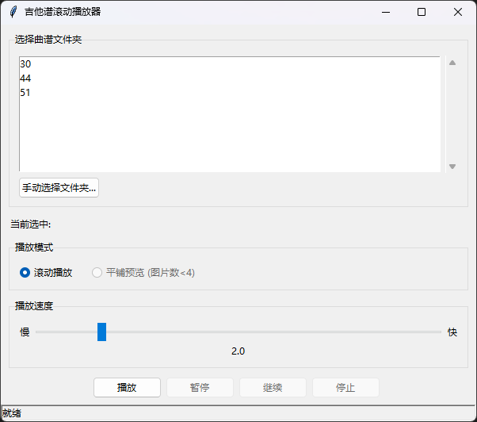

# 🎸 Guitar Scroll Player

> A Python + OpenCV application to scroll through guitar (or any instrument) sheet music on your screen — no more paper flipping!

<p align="center">
  
</p>
---

## ✨ Features

- **Scroll Mode**: Vertically stitches all images in a folder and scrolls upward at adjustable speed — perfect for hands-free performance.
- **Preview Mode**: Horizontally tiles all images into one long preview — great for quick structure review.
- **Auto-sorting**: Automatically sorts images by numeric filename (e.g., `0.png`, `1.png`, ..., `10.png`, `11.png`).
- **Speed Control**: Adjust scroll speed on-the-fly with keyboard shortcuts.
- **Playback Controls**: Pause (`Space`), Resume, Stop (`Esc`) during scrolling.
- **Format Support**: `.png`, `.jpg`, `.jpeg`.

---

## 📦 Installation & Setup

### 1. Clone the Repository

```bash
git clone https://github.com/Jerry-Chen1999/Guitar-scroll-player
cd guitar-scroll-player